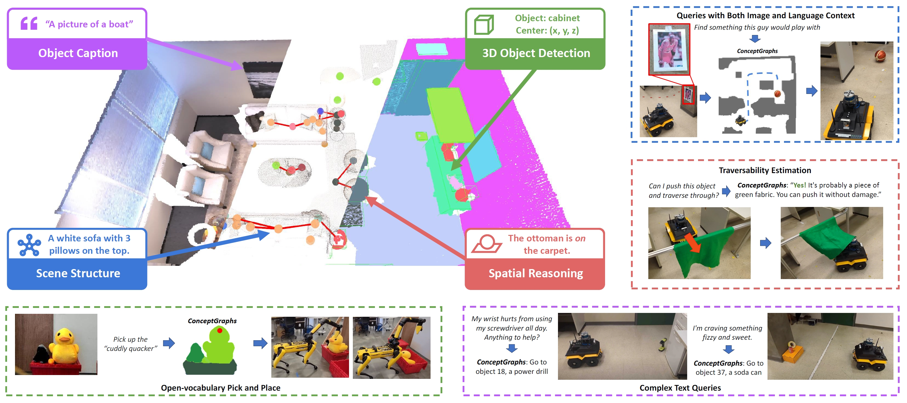
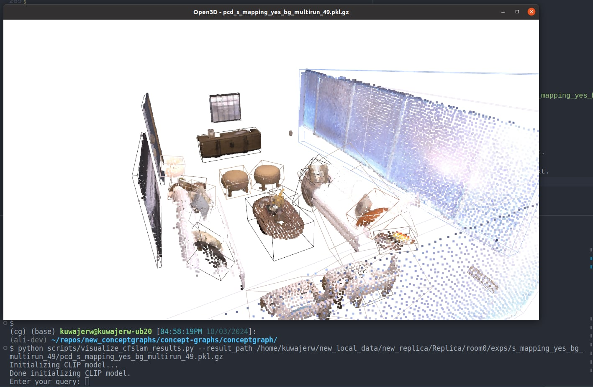
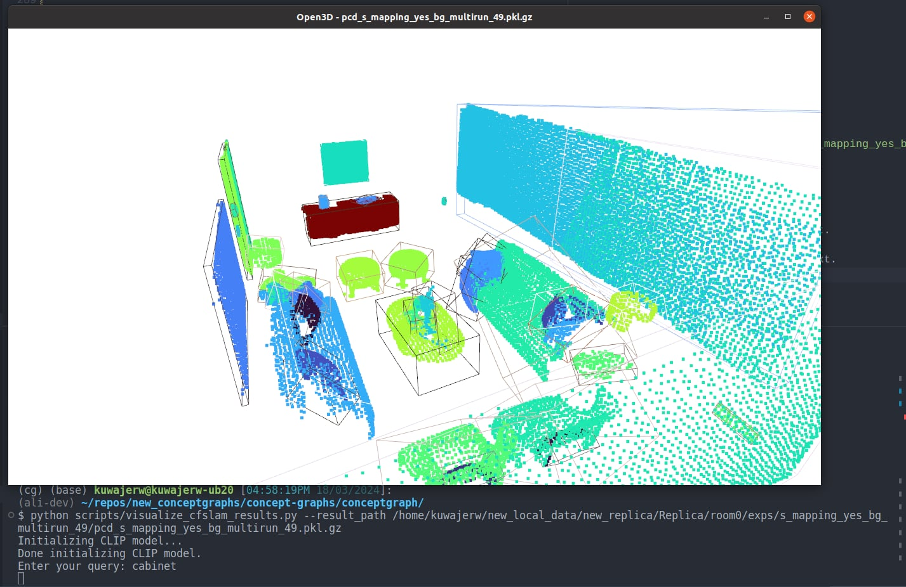

# ConceptGraphs: Open-Vocabulary 3D Scene Graphs for Perception and Planning

This repository contains the code for the ConceptGraphs project. ConceptGraphs builds open-vocabulary 3D scenegraphs that enable a broad range of perception and task planning capabilities.

[**Project Page**](https://concept-graphs.github.io/) |
[**Paper**](https://concept-graphs.github.io/assets/pdf/2023-ConceptGraphs.pdf) |
[**ArXiv**](https://arxiv.org/abs/2309.16650) |
[**Video**](https://www.youtube.com/watch?v=mRhNkQwRYnc&feature=youtu.be&ab_channel=AliK)


[Qiao Gu](https://georgegu1997.github.io/)\*,
[Ali Kuwajerwala](https://www.alihkw.com/)\*,
[Sacha Morin](https://sachamorin.github.io/)\*,
[Krishna Murthy Jatavallabhula](https://krrish94.github.io/)\*,
[Bipasha Sen](https://bipashasen.github.io/),
[Aditya Agarwal](https://skymanaditya1.github.io/),
[Corban Rivera](https://www.jhuapl.edu/work/our-organization/research-and-exploratory-development/red-staff-directory/corban-rivera),
[William Paul](https://scholar.google.com/citations?user=92bmh84AAAAJ),
[Kirsty Ellis](https://mila.quebec/en/person/kirsty-ellis/),
[Rama Chellappa](https://engineering.jhu.edu/faculty/rama-chellappa/),
[Chuang Gan](https://people.csail.mit.edu/ganchuang/),
[Celso Miguel de Melo](https://celsodemelo.net/),
[Joshua B. Tenenbaum](http://web.mit.edu/cocosci/josh.html),
[Antonio Torralba](https://groups.csail.mit.edu/vision/torralbalab/),
[Florian Shkurti](http://www.cs.toronto.edu//~florian/),
[Liam Paull](http://liampaull.ca/)



## Installation

You need to install three different repositories to run the code. This is because conceptgraphs depends on gradslam and chamferdist. We will refer to your chosen location for installing repositories as  `/path/to/code`. You you want to install your three repositories as follows:

```bash
/path/to/code/conceptgraphs/
/path/to/code/gradslam/
/path/to/code/chamferdist/
```


Sometimes certain versions of ubuntu/windows, python, pytorch and cuda may not work well together. Unfortunately this means you may need to do some trial and error to get everything working. We have included the versions of the packages we used on our machines, which ran Ubuntu 20.04.

We also recommend using [conda](https://www.anaconda.com/download) to manage your python environment. It creates a separate environment for each project, which is useful for managing dependencies and ensuring that you don't have conflicting versions of packages from other projects.

Run the following commands:

```bash
# Create the conda environment
conda create -n conceptgraph anaconda python=3.10
conda activate conceptgraph

# Install the required libraries
pip install tyro open_clip_torch wandb h5py openai hydra-core distinctipy ultralytics supervision

# Install the Faiss library (CPU version should be fine), this is used for quick indexing of pointclouds for duplicate object matching and merging
conda install -c pytorch faiss-cpu=1.7.4 mkl=2021 blas=1.0=mkl

##### Install Pytorch according to your own setup #####
# For example, if you have a GPU with CUDA 11.8 (We tested it Pytorch 2.0.1)
conda install pytorch==2.0.1 torchvision==0.15.2 torchaudio==2.0.2 pytorch-cuda=11.8 -c pytorch -c nvidia

# Install Pytorch3D (https://github.com/facebookresearch/pytorch3d/blob/main/INSTALL.md)
# conda install pytorch3d -c pytorch3d # This detects a conflict. You can use the command below, maybe with a different version
conda install https://anaconda.org/pytorch3d/pytorch3d/0.7.4/download/linux-64/pytorch3d-0.7.4-py310_cu118_pyt201.tar.bz2

# Install the gradslam package and its dependencies
# You do not need to install them inside the conceptgraph repository folder
# Treat them as separate packages
# Installing chamferdist, if this fails, its not a huge deal, just move on with the installation
cd /path/to/code/
git clone https://github.com/krrish94/chamferdist.git
cd chamferdist
pip install .

# Installing gradslam, make sure to checkout the conceptfusion branch
cd /path/to/code/
git clone https://github.com/gradslam/gradslam.git
cd gradslam
git checkout conceptfusion
pip install .

# We find that cuda development toolkit is the least problemantic way to install cuda. 
# Make sure the version you install is at least close to your cuda version. 
# See here: https://anaconda.org/conda-forge/cudatoolkit-dev
conda install -c conda-forge cudatoolkit-dev

# You also need to ensure that the installed packages can find the right cuda installation.
# You can do this by setting the CUDA_HOME environment variable.
# You can manually set it to the python environment you are using, or set it to the conda prefix of the environment.
export CUDA_HOME=/path/to/anaconda3/envs/conceptgraph/

# Finally install conceptgraphs
cd /path/to/code/
git clone git@github.com:concept-graphs/concept-graphs.git
cd concept-graphs
pip install -e .
```

Now you will need some data to run the code on, the easiest one to use is the [Replica](https://github.com/facebookresearch/Replica-Dataset). You can install it by using the following commands:

```bash
cd /path/to/data
# you can also download the Replica.zip manually through
# link: https://caiyun.139.com/m/i?1A5Ch5C3abNiL password: v3fY (the zip is split into smaller zips because of the size limitation of caiyun)
wget https://cvg-data.inf.ethz.ch/nice-slam/data/Replica.zip
unzip Replica.zip
```

And now you will need to update the paths in the configuration files in the `conceptgraph/hydra_configs` directory to point to your paths. Which is discussed below:

## Usage

Conceptgraphs creates the scene graph structure in a few steps. First it **detects** objects in the scene, then the **mapping** process creates a 3D object-based pointcloud map of the scene, and then it adds the **edges** for mapped objects to build the scene graph.

**After you have changed the needed configuration values**, you can run a script with a simple command, for example to run detections:

```bash
python scripts/streamlined_detections.py
```


## Setting up your configuration 
We use the [hydra](https://hydra.cc/) package to manage the configuration, so you don't have to give it a bunch of command line arguments, just edit the  entries in the corresponding `.yaml` file in `./conceptgraph/hydra_configs/` and run the script.

For example here is my `./conceptgraph/hydra_configs/streamlined_detections.yaml` file:

```yaml
defaults:
  - base
  - base_detections
  - replica
  - sam
  - classes
  - logging_level
  - multirun_replica
  - _self_

stride: 50
exp_suffix: s_detections_stride50_yes_bg_44_mr
save_video: false
```

First the values are loaded from `base.yaml`, then `base_detections.yaml` then `replica.yaml` and so on. If there is a conflict (i.e. two files are modifying the same config parameter), the values from the earlier file are overwritten. i.e. `replica.yaml` will overwrite any confliting values in `base.yaml` and so on.

Finally `_self_` is loaded, which are te values in `streamlined_detections.yaml` itself. This is where you can put your own custom values. Also feel free to add your own `.yaml` files to `./conceptgraph/hydra_configs/` and they will be loaded in the same way.

To run the detections script, you need to edit the paths for the replica dataset in the `replica.yaml` file. Here is an example of my `concept-graphs/conceptgraph/hydra_configs/replica.yaml` file, you need to change these paths to point to where you have installed the replica dataset:

```yaml
dataset_root: /home/kuwajerw/new_local_data/new_replica/Replica
dataset_config: /home/kuwajerw/repos/new_conceptgraphs/concept-graphs/conceptgraph/dataset/dataconfigs/replica/replica.yaml
scene_id: room0
render_camera_path: /home/kuwajerw/repos/new_conceptgraphs/concept-graphs/conceptgraph/dataset/dataconfigs/replica/replica_room0.json
```

## Running the detections script

To run the script, simply run the following command from the `conceptgraph` directory:

```bash
cd /path/to/code/concept-graphs/conceptgraph/
python /scripts/streamlined_detections.py
```

So for me it looks like this. Note that if you don't have the models installed, it should just automatically download them for you.

```bash
(cg) (base) kuwajerw@kuwajerw-ub20 [09:56:10PM 26/02/2024]:
(main) ~/repos/new_conceptgraphs/concept-graphs/conceptgraph/
$ python scripts/streamlined_detections.py 
Done! Execution time of get_dataset function: 0.09 seconds
Downloading https://github.com/ultralytics/assets/releases/download/v8.1.0/yolov8l-world.pt to 'yolov8l-world.pt'...
100%|████████████████████| 91.2M/91.2M [00:00<00:00, 117MB/s]
Done! Execution time of YOLO function: 1.32 seconds
Downloading https://github.com/ultralytics/assets/releases/download/v8.1.0/mobile_sam.pt to 'mobile_sam.pt'...
100%|████████████████████| 38.8M/38.8M [00:00<00:00, 115MB/s]
  9%|███████████▋        | 922/2000 [02:13<02:45,  6.50it/s]
<... detection process continues ...>
```

It will also save a copy of the configuration file in the experiment output directory, so you can see what settings were used for each run. 

It will save the results in the corresponding dataset directory, in a folder called `exps`. It will name the folder with the `exp_suffix` you set in the configuration file, and also save a `config_params.json` file in that folder with the configuration parameters used for the run.

Here is what the ouput of running the detections script looks like for `room0` in the `Replica` dataset:

```bash
.
./Replica # This is the dataset root
./Replica/room0 # This is the scene_id
./Replica/room0/exps # This parent folder of all the results from conceptgraphs

# This is the folder for the specific run, named according to the exp_suffix
./Replica/room0/exps/s_detections_stride50_yes_bg_44_mr 

# This is where the visualizations are saved, they are images with bounding boxes and masks overlayed
./Replica/room0/exps/s_detections_stride50_yes_bg_44_mr/vis 
./Replica/room0/exps/s_detections_stride50_yes_bg_44_mr/vis/frame000000.jpg 
./Replica/room0/exps/s_detections_stride50_yes_bg_44_mr/vis/frame000050.jpg
./Replica/room0/exps/s_detections_stride50_yes_bg_44_mr/vis/frame000100.jpg
... # rest of the frames
./Replica/room0/exps/s_detections_stride50_yes_bg_44_mr/vis/frame001950.jpg

# This is where the detection results are saved, they are in the form of pkl.gz files 
# that contain a dictionary of the detection results
./Replica/room0/exps/s_detections_stride50_yes_bg_44_mr/detections 
./Replica/room0/exps/s_detections_stride50_yes_bg_44_mr/detections/frame000000.pkl.gz
./Replica/room0/exps/s_detections_stride50_yes_bg_44_mr/detections/frame000050.pkl.gz
./Replica/room0/exps/s_detections_stride50_yes_bg_44_mr/detections/frame000100.pkl.gz
... # rest of the frames
./Replica/room0/exps/s_detections_stride50_yes_bg_44_mr/detections/frame001950.pkl.gz
```

## Running the mapping script

Similarly, you need to edit the `streamlined_mapping.yaml` file in the `./conceptgraph/hydra_configs/` directory to point to your paths. Note that you need to tell the mapping script which detection results to use, so you need to set the `detections_exp_suffix` to the `exp_suffix` of the detection run you want to use. So following the example above, you would set 
```yaml
detections_exp_suffix: s_detections_stride50_yes_bg_44_mr
```
in the `streamlined_mapping.yaml` file. Here is what my `streamlined_mapping.yaml` file looks like, again just for illustrative purposes. Note that it inludes a multirun mode, which is useful for automatically running conceptgraphs on multiple scenes sequentially.

```yaml
defaults:
  - base
  - base_mapping
  - replica
  - classes
  - logging_level
  - _self_

detections_exp_suffix: exp_s_detections_stride50_yes_bg_44_mr
stride: 50
exp_suffix: s_mapping_yes_bg_multirun_49
save_video: !!bool True
save_objects_all_frames: !!bool True
# merge_interval: 5
denoise_interval: 5   
# log_level: INFO

hydra:
  verbose: true
  mode: MULTIRUN
  sweeper:
    params:
      scene_id: room0, office0 # 
```

Once you have set up your mapping configuration, then you can run the mapping script with the following command:

```bash
cd /path/to/code/concept-graphs/conceptgraph/
python slam/streamlined_mapping.py
```

And here is what the output folder looks like for the mapping script:

```bash
.
./Replica # This is the dataset root
./Replica/room0 # This is the scene_id
./Replica/room0/exps # This parent folder of all the results from conceptgraphs

# This is the mapping output folder for the specific run, named according to the exp_suffix
./Replica/room0/exps/s_mapping_yes_bg_multirun_49/
# This is the saved configuration file for the run
./Replica/room0/exps/s_mapping_yes_bg_multirun_49/config_params.json
# We also save the configuration file of the detection run which was used 
./Replica/room0/exps/s_mapping_yes_bg_multirun_49/config_params_detections.json
# The mapping results are saved in a pkl.gz file
./Replica/room0/exps/s_mapping_yes_bg_multirun_49/pcd_s_mapping_yes_bg_multirun_49.pkl.gz
# The video of the mapping process is saved in a mp4 file
./Replica/room0/exps/s_mapping_yes_bg_multirun_49/s_mapping_s_mapping_yes_bg_multirun_49.mp4
# If you set save_objects_all_frames=True, then the object mapping results are saved in a folder
./Replica/room0/exps/s_mapping_yes_bg_multirun_49//saved_obj_all_frames
# In the saved_obj_all_frames folder, there is a folder for each detection run used, and in each of those folders there is a pkl.gz file for each object mapping result
./Replica/room0/exps/s_mapping_yes_bg_multirun_49/saved_obj_all_frames/det_exp_s_detections_stride50_yes_bg_44_mr
000001.pkl.gz
000002.pkl.gz
000003.pkl.gz
...
000039.pkl.gz
meta.pkl.gz
```

## Running the visualization script

This script allows you to vizluatize the map in 3D and query the map objects with text. 

```bash
cd /path/to/code/concept-graphs/conceptgraph/
python scripts/visualize_cfslam_results.py --result_path /path/to/output.pkl.gz
```

So for the above example this would look like 

```bash
cd /path/to/code/concept-graphs/conceptgraph/
python scripts/visualize_cfslam_results.py --result_path /path/to/code/concept-graphs/conceptgraph/Replica/room0/exps/s_mapping_yes_bg_multirun_49/pcd_s_mapping_yes_bg_multirun_49.pkl.gz
```

Then in the open3d visualizer window, you can use the following key callbacks to change the visualization. 
* Press `b` to toggle the background point clouds (wall, floor, ceiling, etc.). Only works on the ConceptGraphs-Detect.
* Press `c` to color the point clouds by the object class from the tagging model. Only works on the ConceptGraphs-Detect.
* Press `r` to color the point clouds by RGB. 
* Press `f` and type text in the terminal, and the point cloud will be colored by the CLIP similarity with the input text. 
* Press `i` to color the point clouds by object instance ID. 

Here is what it looks like to search for "cabinet" in the Replica `room0` scene.

First we run the script, and then press `f` to trigger the `Enter your query:` input 



And then we can type `cabinet` and press enter, and the point cloud will be colored by the CLIP similarity with the input text.



That's all for now, we will keep updating this README with more information as we go.


# OLD README FOR CONCEPTGRAPHS BELOW 

# ConceptGraphs: Open-Vocabulary 3D Scene Graphs for Perception and Planning

[**Project Page**](https://concept-graphs.github.io/) |
[**Paper**](https://concept-graphs.github.io/assets/pdf/2023-ConceptGraphs.pdf) |
[**ArXiv**](https://arxiv.org/abs/2309.16650) |
[**Video**](https://www.youtube.com/watch?v=mRhNkQwRYnc&feature=youtu.be&ab_channel=AliK)


[Qiao Gu](https://georgegu1997.github.io/)\*,
[Ali Kuwajerwala](https://www.alihkw.com/)\*,
[Sacha Morin](https://sachamorin.github.io/)\*,
[Krishna Murthy Jatavallabhula](https://krrish94.github.io/)\*,
[Bipasha Sen](https://bipashasen.github.io/),
[Aditya Agarwal](https://skymanaditya1.github.io/),
[Corban Rivera](https://www.jhuapl.edu/work/our-organization/research-and-exploratory-development/red-staff-directory/corban-rivera),
[William Paul](https://scholar.google.com/citations?user=92bmh84AAAAJ),
[Kirsty Ellis](https://mila.quebec/en/person/kirsty-ellis/),
[Rama Chellappa](https://engineering.jhu.edu/faculty/rama-chellappa/),
[Chuang Gan](https://people.csail.mit.edu/ganchuang/),
[Celso Miguel de Melo](https://celsodemelo.net/),
[Joshua B. Tenenbaum](http://web.mit.edu/cocosci/josh.html),
[Antonio Torralba](https://groups.csail.mit.edu/vision/torralbalab/),
[Florian Shkurti](http://www.cs.toronto.edu//~florian/),
[Liam Paull](http://liampaull.ca/)


## Setup

The env variables needed can be found in `env_vars.bash.template`. When following the setup guide below, you can duplicate that files and change the variables accordingly for easy setup. 

### Install the required libraries

We recommend setting up a virtual environment using virtualenv or conda. Our code has been tested with Python 3.10.12. It may also work with other later versions. We also provide the `environment.yml` file for Conda users. In generaly, directly installing conda env using `.yml` file may cause some unexpected issues, so we recommand setting up the environment by the following instructions and only using the `.yml` file as a reference. 

Sample instructions for `conda` users. 

```bash
conda create -n conceptgraph anaconda python=3.10
conda activate conceptgraph

# Install the required libraries
pip install tyro open_clip_torch wandb h5py openai hydra-core distinctipy

# for yolo
pip install ultralytics

pip install supervision

# Install the Faiss library (CPU version should be fine)
conda install -c pytorch faiss-cpu=1.7.4 mkl=2021 blas=1.0=mkl

##### Install Pytorch according to your own setup #####
# For example, if you have a GPU with CUDA 11.8 (We tested it Pytorch 2.0.1)
conda install pytorch==2.0.1 torchvision==0.15.2 torchaudio==2.0.2 pytorch-cuda=11.8 -c pytorch -c nvidia

# Install Pytorch3D (https://github.com/facebookresearch/pytorch3d/blob/main/INSTALL.md)
# conda install pytorch3d -c pytorch3d # This detects a conflict. You can use the command below, maybe with a different version
conda install https://anaconda.org/pytorch3d/pytorch3d/0.7.4/download/linux-64/pytorch3d-0.7.4-py310_cu118_pyt201.tar.bz2

# Install the gradslam package and its dependencies
git clone https://github.com/krrish94/chamferdist.git
cd chamferdist
pip install .
cd ..
git clone https://github.com/gradslam/gradslam.git
cd gradslam
git checkout conceptfusion
pip install .
```

### Install [Grounded-SAM](https://github.com/IDEA-Research/Grounded-Segment-Anything) package

Follow the instructions on the original [repo](https://github.com/IDEA-Research/Grounded-Segment-Anything#install-without-docker). ConceptGraphs has been tested with the codebase at this [commit](https://github.com/IDEA-Research/Grounded-Segment-Anything/commit/a4d76a2b55e348943cba4cd57d7553c354296223). Grounded-SAM codebase at later commits may require some adaptations. 

First checkout the package by 

```bash
git clone git@github.com:IDEA-Research/Grounded-Segment-Anything.git
```

Then, install the package Following the commands listed in the original GitHub repo. You can skip the `Install osx` step and the "optional dependencies". 

During this process, you will need to set the `CUDA_HOME` to be where the CUDA toolkit is installed. 
The CUDA tookit can be set up system-wide or within a conda environment. We tested it within a conda environment, i.e. installing [cudatoolkit-dev](https://anaconda.org/conda-forge/cudatoolkit-dev) using conda. 

```bash
# i.e. You can install cuda toolkit using conda
conda install -c conda-forge cudatoolkit-dev

# and you need to replace `export CUDA_HOME=/path/to/cuda-11.3/` by 
export CUDA_HOME=/path/to/anaconda3/envs/conceptgraph/
```

You also need to download `ram_swin_large_14m.pth`, `groundingdino_swint_ogc.pth`, `sam_vit_h_4b8939.pth` (and optionally `tag2text_swin_14m.pth` if you want to try Tag2Text) following the instruction [here](https://github.com/IDEA-Research/Grounded-Segment-Anything#label-grounded-sam-with-ram-or-tag2text-for-automatic-labeling). 

After installation, set the path to Grounded-SAM as an environment variable

```bash
export GSA_PATH=/path/to/Grounded-Segment-Anything
```

### (Optional) Set up the EfficientSAM variants

Follow the installation instructions on this [page](https://github.com/IDEA-Research/Grounded-Segment-Anything/tree/main/EfficientSAM). The major steps are:

* Install FastSAM codebase following [here](https://github.com/CASIA-IVA-Lab/FastSAM#installation). You don't have to create a new conda env. Just installing it in the same env as the Grounded-SAM is fine.
* Download FastSAM checkpoints [FastSAM-x.pt](https://github.com/CASIA-IVA-Lab/FastSAM#model-checkpoints) and save it to `Grounded-Segment-Anything/EfficientSAM`. 
* Download MobileSAM checkpoints [mobile_sam.pt](https://github.com/ChaoningZhang/MobileSAM/blob/master/weights/mobile_sam.pt) and save it to `Grounded-Segment-Anything/EfficientSAM`. 
* Download Light HQ-SAM checkpoints [sam_hq_vit_tiny.pth](https://huggingface.co/lkeab/hq-sam/resolve/main/sam_hq_vit_tiny.pth) and save it to `Grounded-Segment-Anything/EfficientSAM`. 


### Install this repo

```bash
git clone git@github.com:concept-graphs/concept-graphs.git
cd concept-graphs
pip install -e .
```

### Set up LLaVA (used for scene graph generation)

Follow the instructions on the [LLaVA repo](https://github.com/haotian-liu/LLaVA) to set it up. You also need to prepare the LLaVA checkpoints and save them to `$LLAVA_MODEL_PATH`. We have tested with model checkpoint `LLaVA-7B-v0` and [LLaVA code](https://github.com/haotian-liu/LLaVA) at this [commit](https://github.com/haotian-liu/LLaVA/commit/8fc54a09a6be74b2abd913c468fb3d42ae826194). LLaVA codebase at later commits may require some adaptations.

```bash
# Set the env variables as follows (change the paths accordingly)
export LLAVA_PYTHON_PATH=/path/to/llava
export LLAVA_MODEL_PATH=/path/to/LLaVA-7B-v0
```

## Prepare dataset (Replica as an example)

ConceptGraphs takes posed RGB-D images as input. Here we show how to prepare the dataset using [Replica](https://github.com/facebookresearch/Replica-Dataset) as an example. Instead of the original Replica dataset, download the scanned RGB-D trajectories of the Replica dataset provided by [Nice-SLAM](https://github.com/cvg/nice-slam). It contains rendered trajectories using the mesh models provided by the original Replica datasets. 

Download the Replica RGB-D scan dataset using the downloading [script](https://github.com/cvg/nice-slam/blob/master/scripts/download_replica.sh) in [Nice-SLAM](https://github.com/cvg/nice-slam#replica-1) and set `$REPLICA_ROOT` to its saved path.

```bash
export REPLICA_ROOT=/path/to/Replica

export CG_FOLDER=/path/to/concept-graphs/
export REPLICA_CONFIG_PATH=${CG_FOLDER}/conceptgraph/dataset/dataconfigs/replica/replica.yaml
```

ConceptGraphs can also be easily run on other dataset. See `dataset/datasets_common.py` for how to write your own dataloader. 

## Run ConceptGraph

The following commands should be run in the `conceptgraph` folder.

```bash
cd conceptgraph
```

### (Optional) Run regular 3D reconstruction for sanity check

The following command runs a 3D RGB reconstruction ([GradSLAM](https://github.com/gradslam/gradslam)) of a replica scene and also visualize it. This is useful for sanity check. 

* `--visualize` requires it to be run with GUI.

```bash
SCENE_NAME=room0
python scripts/run_slam_rgb.py \
    --dataset_root $REPLICA_ROOT \
    --dataset_config $REPLICA_CONFIG_PATH \
    --scene_id $SCENE_NAME \
    --image_height 480 \
    --image_width 640 \
    --stride 5 \
    --visualize
```

### Extract 2D (Detection) Segmentation and per-resgion features

First, (Detection) Segmentation results and per-region CLIP features are extracted. In the following, we provide two options. 
* The first one (ConceptGraphs) uses SAM in the "segment all" mode and extract class-agnostic masks. 
* The second one (ConceptGraphs-Detect) uses a tagging model and a detection model to extract class-aware bounding boxes first, and then use them as prompts for SAM to segment each object. 

```bash
SCENE_NAME=room0

# The CoceptGraphs (without open-vocab detector)
python scripts/generate_gsa_results.py \
    --dataset_root $REPLICA_ROOT \
    --dataset_config $REPLICA_CONFIG_PATH \
    --scene_id $SCENE_NAME \
    --class_set none \
    --stride 5

# The ConceptGraphs-Detect 
CLASS_SET=ram
python scripts/generate_gsa_results.py \
    --dataset_root $REPLICA_ROOT \
    --dataset_config $REPLICA_CONFIG_PATH \
    --scene_id $SCENE_NAME \
    --class_set $CLASS_SET \
    --box_threshold 0.2 \
    --text_threshold 0.2 \
    --stride 5 \
    --add_bg_classes \
    --accumu_classes \
    --exp_suffix withbg_allclasses
```

The above commands will save the detection and segmentation results in `$REPLICA_ROOT/$SCENE_NAME/`. 
The visualization of the detection and segmentation can be viewed in `$REPLICA_ROOT/$SCENE_NAME/gsa_vis_none` and `$REPLICA_ROOT/$SCENE_NAME/gsa_vis_ram_withbg_allclasses` respectively. 

You can ignore the `There's a wrong phrase happen, this is because of our post-process merged wrong tokens, which will be modified in the future. We will assign it with a random label at this time.` message for now. 

### Run the 3D object mapping system

The following command builds an object-based 3D map of the scene, using the image segmentation results from above.  

* Use `save_objects_all_frames=True` to save the mapping results at every frame, which can be used for animated visualization by `scripts/animate_mapping_interactive.py` and `scripts/animate_mapping_save.py`. 
* Use `merge_interval=20  merge_visual_sim_thresh=0.8  merge_text_sim_thresh=0.8` to also perform overlap-based merging during the mapping process. 

```bash
# Using the CoceptGraphs (without open-vocab detector)
THRESHOLD=1.2
python slam/cfslam_pipeline_batch.py \
    dataset_root=$REPLICA_ROOT \
    dataset_config=$REPLICA_CONFIG_PATH \
    stride=5 \
    scene_id=$SCENE_NAME \
    spatial_sim_type=overlap \
    mask_conf_threshold=0.95 \
    match_method=sim_sum \
    sim_threshold=${THRESHOLD} \
    dbscan_eps=0.1 \
    gsa_variant=none \
    class_agnostic=True \
    skip_bg=True \
    max_bbox_area_ratio=0.5 \
    save_suffix=overlap_maskconf0.95_simsum${THRESHOLD}_dbscan.1_merge20_masksub \
    merge_interval=20 \
    merge_visual_sim_thresh=0.8 \
    merge_text_sim_thresh=0.8

# On the ConceptGraphs-Detect 
SCENE_NAMES=room0
THRESHOLD=1.2
python slam/cfslam_pipeline_batch.py \
    dataset_root=$REPLICA_ROOT \
    dataset_config=$REPLICA_CONFIG_PATH \
    stride=5 \
    scene_id=$SCENE_NAME \
    spatial_sim_type=overlap \
    mask_conf_threshold=0.25 \
    match_method=sim_sum \
    sim_threshold=${THRESHOLD} \
    dbscan_eps=0.1 \
    gsa_variant=ram_withbg_allclasses \
    skip_bg=False \
    max_bbox_area_ratio=0.5 \
    save_suffix=overlap_maskconf0.25_simsum${THRESHOLD}_dbscan.1
```

The above commands will save the mapping results in `$REPLICA_ROOT/$SCENE_NAME/pcd_saves`. It will create two `pkl.gz` files, where the one with `_post` suffix indicates results after some post processing, which we recommend using.`

If you run the above command with `save_objects_all_frames=True`, it will create a folder in `$REPLICA_ROOT/$SCENE_NAME/objects_all_frames`. Then you can run the following command to visualize the mapping process or save it to a video. Also see the relevant files for available key callbacks for viusalization options. 

```
python scripts/animate_mapping_interactive.py --input_folder $REPLICA_ROOT/$SCENE_NAME/objects_all_frames/<folder_name>
python scripts/animate_mapping_save.py --input_folder $REPLICA_ROOT/$SCENE_NAME/objects_all_frames/<folder_name>
```

### Visualize the object-based mapping results

```bash
python scripts/visualize_cfslam_results.py --result_path /path/to/output.pkl.gz
```

Then in the open3d visualizer window, you can use the following key callbacks to change the visualization. 
* Press `b` to toggle the background point clouds (wall, floor, ceiling, etc.). Only works on the ConceptGraphs-Detect.
* Press `c` to color the point clouds by the object class from the tagging model. Only works on the ConceptGraphs-Detect.
* Press `r` to color the point clouds by RGB. 
* Press `f` and type text in the terminal, and the point cloud will be colored by the CLIP similarity with the input text. 
* Press `i` to color the point clouds by object instance ID. 

### Evaluate semantic segmentation from the object-based mapping results on Replica datasets

First, download the GT point cloud with per-point semantic segmentation labels from this [Google Drive link](https://drive.google.com/file/d/1NhQIM5PCH5L5vkZDSRq6YF1bRaSX2aem/view?usp=sharing). Please refer to [this issue](https://github.com/concept-graphs/concept-graphs/issues/18#issuecomment-1876673985) for a brief description of how they are generated. Unzip the file and record its location in `REPLICA_SEMANTIC_ROOT`. 

Then run the following command to evaluate the semantic segmentation results. The results will be saved in the `results` folder, where the mean recall `mrecall` is the mAcc and `fmiou` is the F-mIoU reported in the paper. 

```bash
# CoceptGraphs (without open-vocab detector)
python scripts/eval_replica_semseg.py \
    --replica_root $REPLICA_ROOT \
    --replica_semantic_root $REPLICA_SEMANTIC_ROOT \
    --n_exclude 6 \
    --pred_exp_name none_overlap_maskconf0.95_simsum1.2_dbscan.1_merge20_masksub

# On the ConceptGraphs-Detect (Grounding-DINO as the object detector)
python scripts/eval_replica_semseg.py \
    --replica_root $REPLICA_ROOT \
    --replica_semantic_root $REPLICA_SEMANTIC_ROOT \
    --n_exclude 6 \
    --pred_exp_name ram_withbg_allclasses_overlap_maskconf0.25_simsum1.2_dbscan.1_masksub
```


### Extract object captions and build scene graphs

Ensure that the `openai` package is installed and that your APIKEY is set. We recommend using GPT-4, since GPT-3.5 often produces inconsistent results on this task.
```bash
export OPENAI_API_KEY=<your GPT-4 API KEY here>
```

Also note that you may need to make the following change at [this line](https://github.com/haotian-liu/LLaVA/blob/main/llava/mm_utils.py#L68) in the original LLaVa repo to run the following commands. 

```python
            # if output_ids[0, -keyword_id.shape[0]:] == keyword_id:
            #     return True
            if torch.equal(output_ids[0, -keyword_id.shape[0]:], keyword_id):
                return True
```

Then run the following commands sequentially to extract per-object captions and build the 3D scene graph. 

```bash
SCENE_NAME=room0
PKL_FILENAME=output.pkl.gz  # Change this to the actual output file name of the pkl.gz file

python scenegraph/build_scenegraph_cfslam.py \
    --mode extract-node-captions \
    --cachedir ${REPLICA_ROOT}/${SCENE_NAME}/sg_cache \
    --mapfile ${REPLICA_ROOT}/${SCENE_NAME}/pcd_saves/${PKL_FILENAME} \
    --class_names_file ${REPLICA_ROOT}/${SCENE_NAME}/gsa_classes_ram_withbg_allclasses.json

python scenegraph/build_scenegraph_cfslam.py \
    --mode refine-node-captions \
    --cachedir ${REPLICA_ROOT}/${SCENE_NAME}/sg_cache \
    --mapfile ${REPLICA_ROOT}/${SCENE_NAME}/pcd_saves/${PKL_FILENAME} \
    --class_names_file ${REPLICA_ROOT}/${SCENE_NAME}/gsa_classes_ram_withbg_allclasses.json

python scenegraph/build_scenegraph_cfslam.py \
    --mode build-scenegraph \
    --cachedir ${REPLICA_ROOT}/${SCENE_NAME}/sg_cache \
    --mapfile ${REPLICA_ROOT}/${SCENE_NAME}/pcd_saves/${PKL_FILENAME} \
    --class_names_file ${REPLICA_ROOT}/${SCENE_NAME}/gsa_classes_ram_withbg_allclasses.json
```

Then the object map with scene graph can be visualized using the following command. 
* Press `g` to show the scene graph. 
* Press "+" and "-" to increase and decrease the size of point cloud for better visualization.

```bash
python scripts/visualize_cfslam_results.py \
    --result_path ${REPLICA_ROOT}/${SCENE_NAME}/sg_cache/map/scene_map_cfslam_pruned.pkl.gz \
    --edge_file ${REPLICA_ROOT}/${SCENE_NAME}/sg_cache/cfslam_object_relations.json
```


## AI2Thor-related experiments

During the development stage, we performed some experiments on the AI2Thor dataset. 
Upon request, now we provide the code and instructions for these experiments. 
However, note that we didn't perform any quantitative evaluation on AI2Thor. 
And because of domain gap, performance of ConceptGraphs may be worse than other datasets reported. 

### Setup 

Use our own [fork](https://github.com/georgegu1997/ai2thor), where some changes were made to record the interaction trajectories. 

```bash
cd .. # go back to the root folder CFSLAM
git clone git@github.com:georgegu1997/ai2thor.git
cd ai2thor
git checkout main5.0.0
pip install -e .

# This is for the ProcThor dataset.
pip install ai2thor-colab prior --upgrade
```

If you meet error saying `Could not load the Qt platform plugin "xcb"` later on, it probably means that is some weird issue with `opencv-python` and `opencv-python-headless`. Try uninstalling them and install one of them back. 

### Generating AI2Thor datasets

1. Use `$AI2THOR_DATASET_ROOT` as the directory ai2thor dataset and save it to a variable. Also set the scene used from AI2Thor. 

```bash
# Change this to run it in a different scene in AI2Thor environment
# train_3 is a scene from the ProcThor dataset, which containing multiple rooms in one house
SCENE_NAME=train_3

# The following scripts need to be run in the conceptgraph folder
cd ./conceptgraph
```

2. Generate a densely captured grid map for the selected scene. 
```bash
# Uniform sample camera locations (XY + Yaw)
python scripts/generate_ai2thor_dataset.py --dataset_root $AI2THOR_DATASET_ROOT --scene_name $SCENE_NAME --sample_method uniform --n_sample -1 --grid_size 0.5
# Uniform sample + randomize lighting
python scripts/generate_ai2thor_dataset.py --dataset_root $AI2THOR_DATASET_ROOT --scene_name $SCENE_NAME --sample_method uniform --n_sample -1 --grid_size 0.5 --save_suffix randlight --randomize_lighting
```

3. Generate a human-controlled trajectory for the selected scene. (GUI and keyboard interaction needed)
```bash
# Interact generation and save trajectory files. 
# This line will open up a Unity window. You can control the agent with arrow keys in the terminal window. 
python scripts/generate_ai2thor_dataset.py --dataset_root $AI2THOR_DATASET_ROOT --scene_name $SCENE_NAME --interact

# Generate observations from the saved trajectory file
python scripts/generate_ai2thor_dataset.py --dataset_root $AI2THOR_DATASET_ROOT --scene_name $SCENE_NAME --sample_method from_file
```

4. Generate a trajectory with object randomly moved. 
```bash
MOVE_RATIO=0.25
RAND_SUFFIX=mv${MOVE_RATIO}
python scripts/generate_ai2thor_dataset.py \
    --dataset_root $AI2THOR_DATASET_ROOT \
    --scene_name $SCENE_NAME \
    --interact \
    --save_suffix $RAND_SUFFIX \
    --randomize_move_moveable_ratio $MOVE_RATIO \
    --randomize_move_pickupable_ratio $MOVE_RATIO
```